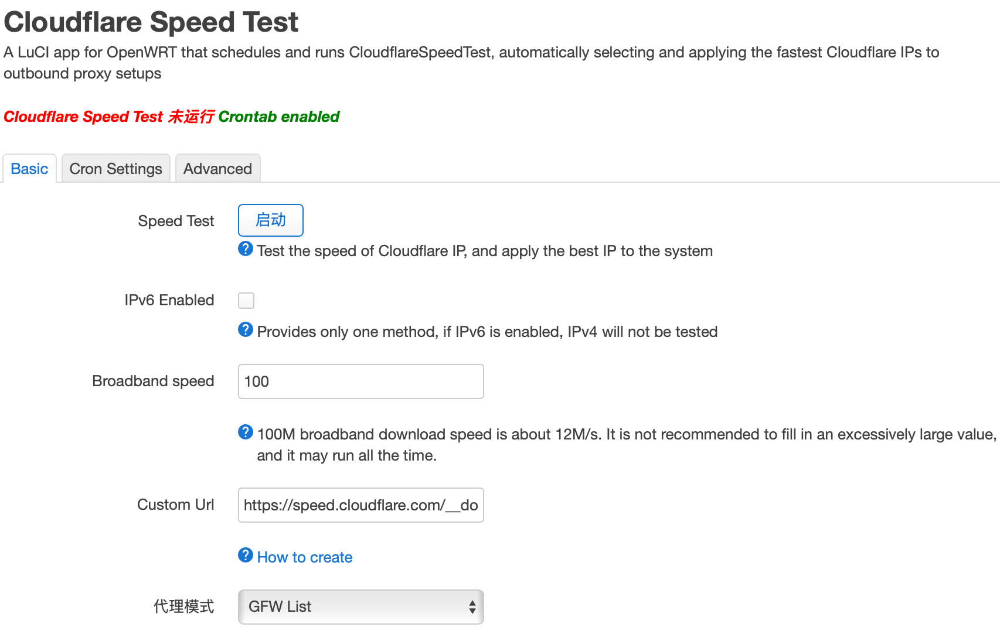
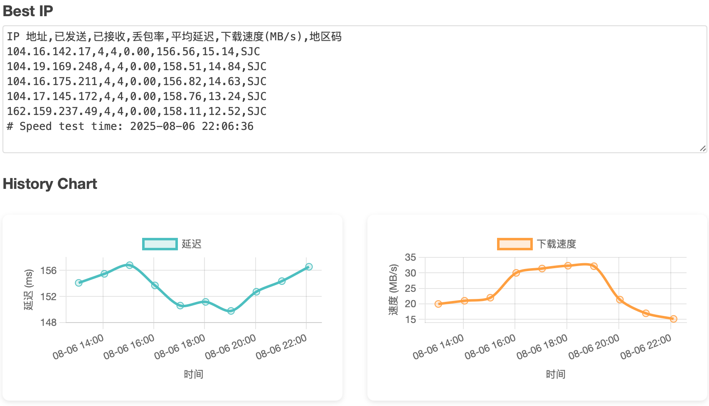

# luci-app-cloudflarespeedtest


Download `.ipk` and `.apk` from [Releases](https://github.com/stevenjoezhang/luci-app-cloudflarespeedtest/releases)

## Features

- 支持手动或定时执行 Cloudflare IP 速度测试
- 集成SSR+和PASSWALL，自动替换IP
- 支持展示速度测试结果图表
- 支持自定义测试参数

## Build

```bash
#compile package only
make package/luci-app-cloudflarespeedtest/compile v=99

#compile
make menuconfig
#choose LuCI ---> 3. Applications  ---> <*> luci-app-cloudflarespeedtest..... for LuCI ----> save
make V=99
```

## Screenshots




## Acknowledgements

[CloudflareSpeedTest](https://github.com/XIU2/CloudflareSpeedTest)
